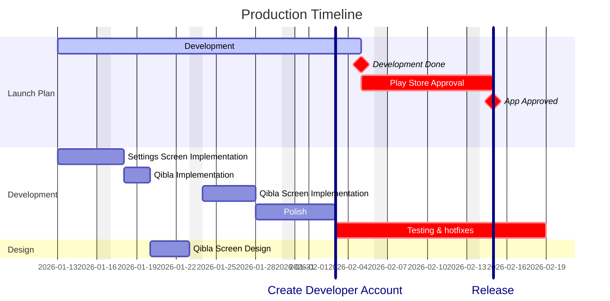

# Prayer Times

## Why are we building this?
You've probably seen a million apps like this one, but let us tell you why this one is special.

There are a lot of apps like these in the app store, most of them either block you behind a pay-wall just to use the favourite Athan sound of yours or they're completely free but poor in features. **Our goal** is to make it possible to build that perfect app that **combines the best of the two worlds** by the support of collaborators and users.

## Our Vision
The aim of this project is to provide an easy way for Muslims around the world to stay on track with their prayer times.

**We take it upon ourselves** to keep this project ad-free, offline and open-source.

We're not just making another prayer times app. We're building the most **feature rich, intuitive app**, all while keeping it **free-to-use**.

## how to install
1. clone the repository.
2. cd into the project folder.
3. run `flutter pub get`
4. You're ready to `run` the app!

## Collaboration Guidelines

Your participation is welcome!  
**Refer to the [docs](./docs) for technical details.**

**Important Practices:**
- Always create a new branch for your work. Do not edit directly on the `main` branch.
- Branch names should follow this format:  
  `<type>/<short-description>`
- **Accepted types and use cases:**
  - **feature/**: For developing new features or significant enhancements.
  - **bugfix/**: For fixing bugs or resolving issues.
  - **hotfix/**: For urgent or critical fixes, typically in production.
  - **chore/**: For routine tasks, maintenance, or non-feature changes (e.g., dependency updates, refactoring).
  - **docs/**: For documentation changes only.
  - **test/**: For adding, updating, or improving tests.
  - **devops/**: For CI/CD and GitHub actions.

This convention keeps the project organized and streamlines collaboration.
